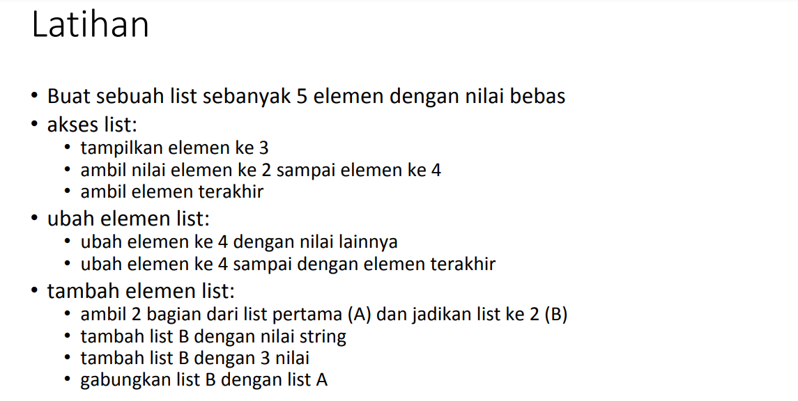
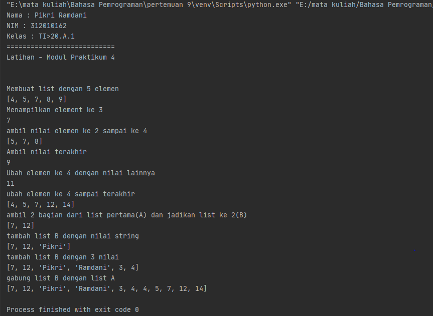
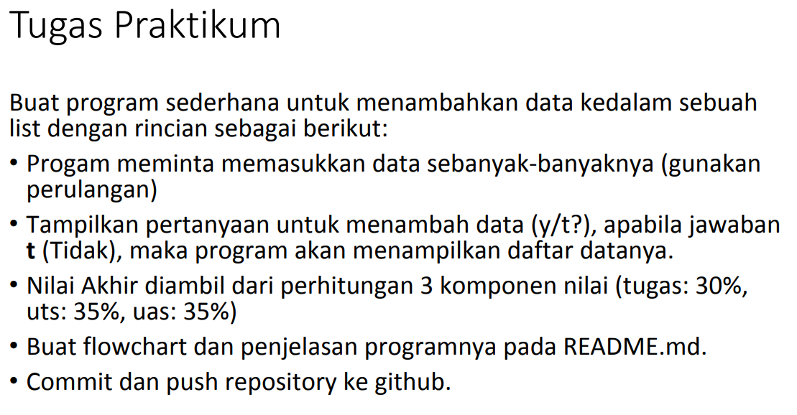
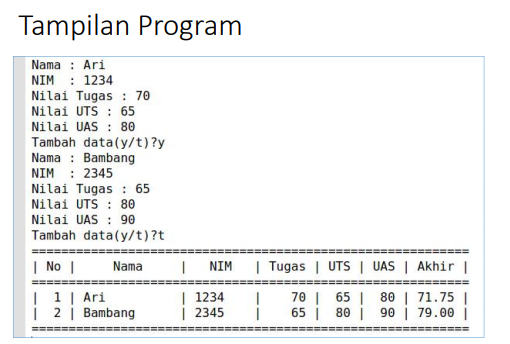
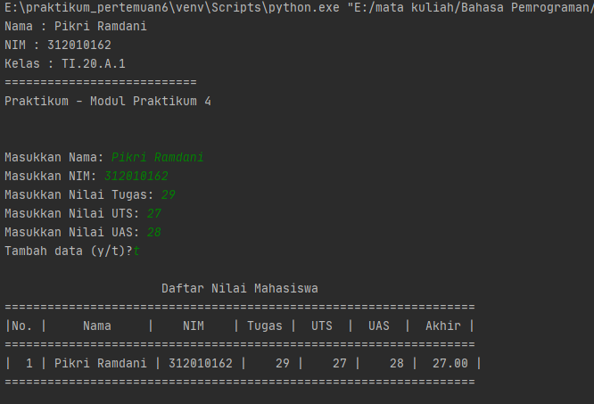
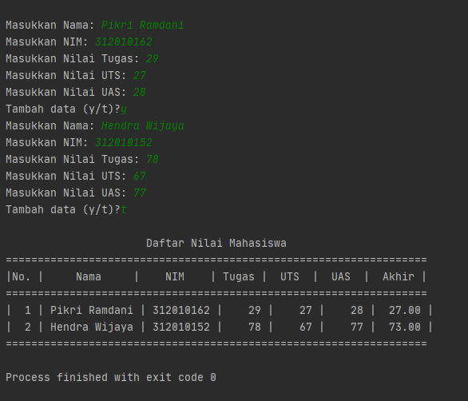

# pertemuan9
Repository ini dibuat untuk memenuhi tugas pada pertemuan ke 9.
<hr>

 Nama   : Pikri Ramdani <br>
 NIM    : 312010162     <br>
 Kelas  : TI.20.A.1     <br>

Pada mata kuliah Bahasa Pemrograman - Pertemuan 9 kali ini saya mendapatkan materi *list, Tuple dan Dictianory*.<br>
Nah, untuk praktikum 4 ini materi yang di dapatkan adalah **list**.<br>
<br>
* Didalam materi praktikum 4 ini terdapat 2 tugas. yaitu : Latihan dan Praktikum.<br>

## pertemuan 9 - praktikum 4 - Latihan

* Berikut adalah tugas dari latihan, bisa di lihat pada gambar dibawah ini :<br>
<br>
* Berikut jawaban / *source code* / program data kedalam list yang telah saya buat :
``` python
print("Nama : Pikri Ramdani")
print("NIM : 312010162")
print("Kelas : TI.20.A.1")
print("===========================")
print("Latihan - Modul Praktikum 4")
print()
print()

print("Membuat list dengan 5 elemen")
data = [4, 5, 7, 8, 9]
print(data)
# akses list
print("Menampilkan element ke 3")
print(data[2])

print("ambil nilai elemen ke 2 sampai ke 4")
print(data[1:4])

print("Ambil nilai terakhir")
print(data[-1])

# ubah elemen list
print("Ubah elemen ke 4 dengan nilai lainnya")
data[3] = 11
print(data[3])

print("ubah elemen ke 4 sampai terakhir")
data[3:5] = [12, 14]
print(data)

# tambah elemen list
print("ambil 2 bagian dari list pertama(A) dan jadikan list ke 2(B)")
baris = data[2:4]
print(baris)

print("tambah list B dengan nilai string")
baris.append("Pikri")
print(baris)

print("tambah list B dengan 3 nilai")
baris.extend(["Ramdani", 3, 4])
print(baris)

print("gabung list B dengan list A")
gabung = baris+datas
print(gabung)
```
* Untuk hasil dari source code tersebut adalah seperti berikut : <br>
<br>

## Pertemuan 9 - Praktikum 4

Untuk tugas yang kedua Tugas praktikum, yaitu tugas untuk membuat program sederhana menampilkan Data nilai mahasiswa<br>
* Berikut soal yang di berikan oleh Dosen :<br>
<br>

* Hasil yang di harapkan oleh dosen seperti berikut :<br>
<br>

* Selain membaca dan memahami materi yang diberikan oleh Dosen, saya juga mencari refrensi dari google dan forum pemrograman yang ada di internet. pada akhirnya saya bisa membuat program yang diberikan oleh dosen.

* Berikut source code yang telah saya temukan untuk membuat program sederhana Data Nilai Mahasiswa :<br>__
``` python
print("Nama : Pikri Ramdani")
print("NIM : 312010162")
print("Kelas : TI.20.A.1")
print("===========================")
print("Praktikum - Modul Praktikum 4")
print()
print()

nilai = []
ulang = True

while ulang:
    nama = input("Masukkan Nama: ")
    nim = input("Masukkan NIM: ")
    tugas = int(input("Masukkan Nilai Tugas: "))
    uts = int(input("Masukkan Nilai UTS: "))
    uas = int(input("Masukkan Nilai UAS: "))
    akhir = (tugas * 30/100) + (uts * 35/100) + (uas * 35/100)

    nilai.append([nama, nim, tugas, uts, uas, int(akhir)])
    if (input("Tambah data (y/t)?") == 't'):
        ulang = False

print("\n                      Daftar Nilai Mahasiswa")
print("==================================================================")
print("|No. |     Nama     |    NIM    | Tugas |  UTS  |  UAS  |  Akhir |")
print("==================================================================")
i = 0
for item in nilai:
    i += 1
    print("| {no:2d} | {nama:12s} | {nim:9s} | {tugas:5d} | {uts:5d} | {uas:5d} | {akhir:6.2f} |"
          .format(no=i, nama=item[0], nim=item[1], tugas=item[2], uts=item[3], uas=item[4], akhir=item[5]))
print("==================================================================")
```
* Berikut contoh hasil yang saya dapatkan ketika saya menginputkan 1 data mahasiswa :<br> 


* Berikut contoh hasil yang saya dapatkan ketika saya menginputkan 2 atau lebih Data Nilai Mahasiswa :<br>


* Saya menjelaskan secara singkat tentang source code tersebut, <br>
> Saya menggunakan fungsi while untuk mengatur kondisi, seperti while ulang, jadi jika tidak berhenti maka syntax akan terus menampilkan perintah user untuk menginputkan data mahasiswa<br>
> Penjelasan tersebut atau bisa digunakan ketika kita mengetikan huruf **t** pada perintah : *tambah data? (y/t)*<br>
> Untuk perhitungan nilai akhir sesuai dengan ketentuan yang dosen inginkan, yaitu 30% dari nilai tugas, 35% dari nilai UTS, dan 35% dari Nilai UAS.<br>

<hr>

## pertemuan 9 - praktikum 5

Pada halaman ini (tugas pertemuan9-praktikum5) saya diberikan tugas oleh dosen yaitu membuat program sederhana yang akan menampilkan daftar nilai mahasiswa, menggunakan bahasa pemrograman python. Berikut Source Code yang diberikan oleh dosen :<br>
``` python
P = print
while True:
    P("")
    P("")
    c = input("L)ihat, T)ambah, U)bah, H)apus, C)ari, K)eluar: ")
    if c.lower() == 'q':
        break
    elif c.lower() == 'l':
        i = open('database.txt',"r").read().splitlines()
        P(" ╔═════════════════════════════════════════════════════════════════════╗")
        P(" ╠════════════════════════════ DAFTAR KONTAK ══════════════════════════╣")
        P(" ╠══════════════════╦══════════════════╦═══════╦═══════╦═══════╦═══════╣")
        P(" ║      NAMA        ║       NIM        ║ TUGAS ║  UTS  ║  UAS  ║ AKHIR ║")
        P(" ╠══════════════════╬══════════════════╬═══════╬═══════╬═══════╬═══════╣")
        for l in i:
            if l == '':
                pass
            else:
                l1 = l.replace('Nama : ', '').replace('Nim : ', '').replace('Tugas : ', '').replace('UTS : ',
                                                                                                    '').replace(
                    'UAS : ', '').replace('Akhir : ', '')
                na, ni, tu, uts, uas, akhir = l1.strip().split('|')
                P((' ║ ') + (na[:15]).ljust(17, '.') + ('║ ') + (ni).ljust(17) + ('║ ') + (tu).ljust(6) + ('║ ') + (
                    uts).ljust(6) + ('║ ') + (uas).ljust(6) + ('║ ') + (akhir).ljust(6) + ('║') )
        P(" ╚══════════════════╩══════════════════╩═══════╩═══════╩═══════╩═══════╝")
    elif c.lower() == 'c':
        cari = input(' Mencari : ')
        i = open('database.txt', 'r').read().splitlines()
        P(" ╔═════════════════════════════════════════════════════════════════════╗")
        P(" ╠════════════════════════════ DAFTAR KONTAK ══════════════════════════╣")
        P(" ╠══════════════════╦══════════════════╦═══════╦═══════╦═══════╦═══════╣")
        P(" ║      NAMA        ║       NIM        ║ TUGAS ║  UTS  ║  UAS  ║ AKHIR ║")
        P(" ╠══════════════════╬══════════════════╬═══════╬═══════╬═══════╬═══════╣")
        for l in i:
            if l == '':
                pass
            elif cari in l:
                l1 = l.replace('Nama : ', '').replace('Nim : ', '').replace('Tugas : ', '').replace('UTS : ',
                                                                                                    '').replace(
                    'UAS : ', '').replace('Akhir : ', '')
                na, ni, tu, uts, uas, akhir = l1.strip().split('|')
                P((' ║ ') + (na).ljust(17) + ('║ ') + (ni).ljust(17) + ('║ ') + (tu).ljust(6) + ('║ ') + (uts).ljust(
                    6) + ('║ ') + (uas).ljust(6) + ('║ ') + (akhir).ljust(6) + ('║'))
        P(" ╚══════════════════╩══════════════════╩═══════╩═══════╩═══════╩═══════╝")
    elif c.lower() == 'h':
        u = open('database.txt', 'r').read().splitlines()
        target = input(' Masukan Nama : ')
        nm = []
        for l in u:
            if l == '':
                pass
            else:
                l1 = l.replace('Nama : ', '').replace('Nim : ', '').replace('Tugas : ', '').replace('UTS : ',
                                                                                                    '').replace(
                    'UAS : ', '').replace('Akhir : ', '')
                na, ni, tu, uts, uas, akhir = l1.strip().split('|')
                if str(na) == str(target):
                    P('BERHASIL MENGHAPUS Data %s' % (target))
                    pass
                else:
                    nm.append(str(l) + '\n')
        new = open('database.txt', 'w')
        new.write(str(nm))
        new.close()
        new = open('database.txt', 'r').read().splitlines()
        new1 = open('database.txt', 'w')
        new1.close()
        new2 = open('database.txt', 'a')
        for i in new:
            i2 = i.replace("['", "").replace("\\n', '", "\n").replace("']", "").replace("\\n", '')
            new2.write(i2)
        new2.close()
    elif c.lower() == 'u':
        u = open('database.txt', 'r').read().splitlines()
        target = input(' Masukan Nama : ')
        nm = []
        for l in u:
            if l == '':
                pass
            else:
                l1 = l.replace('Nama : ', '').replace('Nim : ', '').replace('Tugas : ', '').replace('UTS : ',
                                                                                                    '').replace(
                    'UAS : ', '').replace('Akhir : ', '')
                na, ni, tu, uts, uas, akhir = l1.strip().split('|')
                if na == target:
                    P(' Mengedit Data %s' % (target))
                    while (True):
                        nama = input(" Nama : ")
                        if nama == '':
                            P(' Masukan dengan Nama Dengan Benar')
                        else:
                            break
                    while (True):
                        try:
                            nim = int(input(" NIM  : "))
                            if nim == '':
                                P(' Masukan Nim dengan Angka')
                        except ValueError:
                            P(' Masukan Nim dengan Angka')
                        else:
                            break
                    while (True):
                        try:
                            tugas = int(input(" TUGAS  : "))
                            if tugas == '':
                                P(' Masukan TUGAS dengan Angka')
                        except ValueError:
                            P(' Masukan TUGAS dengan Angka')
                        else:
                            break
                    while (True):
                        try:
                            uts = int(input(" UTS  : "))
                            if uts == '':
                                P(' Masukan UTS dengan Angka')
                        except ValueError:
                            P(' Masukan UTS dengan Angka')
                        else:
                            break
                    while (True):
                        try:
                            uas = int(input(" UAS  : "))
                            if uas == '':
                                P(' Masukan UAS dengan Angka')
                        except ValueError:
                            P(' Masukan UAS dengan Angka')
                        else:
                            break
                    akhir = round((float(tugas) * 0.3) + (float(uts) * 0.35) + (float(uas) * 0.35), 2)
                    edit = ('Nama : ' + nama + '|Nim : ' + str(nim) + '|Tugas : ' + str(tugas) + '|UTS : ' + str(
                        uts) + '|UAS : ' + str(uas) + "|Akhir : " + str(akhir) + '\n')
                    nm.append(edit + '\n')
                else:
                    nm.append(str(l) + '\n')
        new = open('database.txt', 'w')
        new.write(str(nm))
        new.close()
        new = open('database.txt', 'r').read().splitlines()
        new1 = open('database.txt', 'w')
        new1.close()
        new2 = open('database.txt', 'a')
        for i in new:
            i2 = i.replace("['", "").replace("\\n', '", "\n").replace("']", "").replace("\\n", "\n")
            new2.write(i2 + '\n')
        new2.close()
    elif c.lower() == 't':
        i = open('database.txt', 'a')
        P(" Tambah Kontak")
        while (True):
            nama = input(" Nama : ")
            if nama == '':
                P(' Masukan dengan Nama Dengan Benar')
            else:
                break
        while (True):
            try:
                nim = int(input(" NIM  : "))
                if nim == '':
                    P(' Masukan Nim dengan Angka')
            except ValueError:
                P(' Masukan Nim dengan Angka')
            else:
                break
        while (True):
            try:
                tugas = int(input(" TUGAS  : "))
                if tugas == '':
                    P(' Masukan TUGAS dengan Angka')
            except ValueError:
                P(' Masukan TUGAS dengan Angka')
            else:
                break
        while (True):
            try:
                uts = int(input(" UTS  : "))
                if uts == '':
                    P(' Masukan UTS dengan Angka')
            except ValueError:
                P(' Masukan UTS dengan Angka')
            else:
                break
        while (True):
            try:
                uas = int(input(" UAS  : "))
                if uas == '':
                    P(' Masukan UAS dengan Angka')
            except ValueError:
                P(' Masukan UAS dengan Angka')
            else:
                break
        akhir = round((float(tugas) * 0.3) + (float(uts) * 0.35) + (float(uas) * 0.35), 2)
        i.write('\nNama : ' + nama + '|Nim : ' + str(nim) + '|Tugas : ' + str(tugas) + '|UTS : ' + str(
            uts) + '|UAS : ' + str(uas) + "|Akhir : " + str(akhir) + '\n')
        i.close()
    else:
        P("Silahkan pilih menu yang tersedia...")

```
